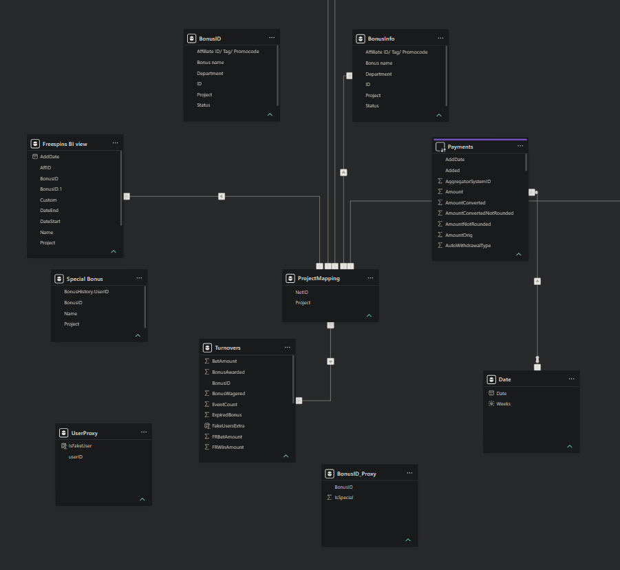
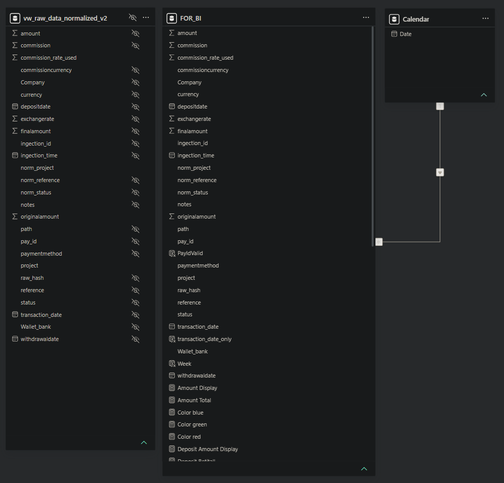

# Financial ETL Pipeline

> **End-to-End Financial Data Engineering Platform** designed to automate financial data acquisition, ETL processing, normalization, analytics and business intelligence reporting across **40+ payment providers and digital wallets**.


---

## Highlights

- 🚀 **40+ payment providers and digital wallets**
- 🔄 **REST APIs, Google Drive & Automated Web Portals**
- ⚙️ **End-to-End ETL Pipeline**
- 🗄️ **PostgreSQL + Microsoft Fabric + Delta Lake**
- 📊 **Power BI Business Intelligence**
- 💱 **Multi-currency reporting & historical exchange rates**

---

# Overview

Financial ETL Pipeline is an end-to-end data engineering platform developed to automate financial data acquisition, ETL processing, normalization and business reporting across **40+ payment providers and digital wallets**.

Designed for production use, the platform integrates heterogeneous financial data sources into a unified analytical model that supports operational reporting, reconciliation and business intelligence.

Financial organizations often receive operational and financial data from multiple providers, each exposing information through different technologies, formats and reporting standards. Some providers offer REST APIs, others distribute reports through shared cloud storage, while many only provide downloadable reports via secured administrative portals.

To solve this challenge, the platform implements a unified acquisition and processing layer capable of automatically collecting, validating, normalizing and transforming financial data before loading it into PostgreSQL and Microsoft Fabric for analytics.

The platform covers the complete lifecycle of financial data:

- **Data Acquisition**
- **ETL Processing**
- **PostgreSQL Data Warehouse**
- **Microsoft Fabric**
- **Delta Lake**
- **Business Intelligence**
- **Power BI Reporting**

---

# Platform Scale

Current implementation includes:

- **40+ payment providers and digital wallets**
- Multiple acquisition methods (REST APIs, Google Drive, Web Automation)
- Automated daily processing pipelines
- Multi-currency transaction processing
- Historical exchange rate calculations
- Financial reconciliation
- Automatic business entity mapping (companies, casino brands and business partners)
- Standardization of payment systems across providers
- Automated classification of deposits and withdrawals
- Interactive Business Intelligence dashboards

---

# Architecture

<p align="center">

</p>

```
External Financial Systems
        │
        ├──────── REST APIs
        │
        ├──────── Google Drive
        │
        └──────── Administrative Web Portals
                        │
                        ▼
            Automated Data Acquisition
                        │
                        ▼
               Validation & ETL Pipeline
                        │
                        ▼
                  PostgreSQL
                        │
                        ▼
               Microsoft Fabric
                        │
                        ▼
                  Delta Lake
                        │
                        ▼
             Business Data Models
                        │
                        ▼
                  Power BI Reports
```

---

# Data Acquisition

The platform automatically retrieves financial reports from heterogeneous external systems.

Supported acquisition methods include:

- REST API integrations
- Google Drive synchronization
- Automated authenticated web portal downloads

Despite completely different source formats, all collected data is transformed into a unified financial transaction model.

> **Confidentiality Notice**
>
> Data acquisition modules are intentionally excluded from this public repository because they contain proprietary authentication workflows, customer-specific integrations and confidential business logic.
>
> This repository focuses on the ETL architecture, data processing, normalization, analytics and reporting layers.

---

# Key Features

- Automated financial data acquisition
- REST API integrations
- Google Drive synchronization
- Automated web portal downloads
- Processing data from **40+ payment providers**
- ETL pipeline
- Financial transaction normalization
- Multi-currency support
- Historical exchange rates
- Weekly crypto rate processing
- Financial reconciliation
- Commission calculation
- Delta Lake integration
- Microsoft Fabric analytics
- Interactive Power BI dashboards

---

# Repository Structure

The repository is organized into modular components, each responsible for a specific stage of the data engineering pipeline.

| Directory | Description |
|-----------|-------------|
| [`config/`](config/) | Configuration files and environment templates |
| [`ingestion/`](ingestion/) | Data acquisition layer (Google Drive synchronization, API integrations and provider-specific ingestion modules) |
| [`pipelines/`](pipelines/) | ETL pipelines for data validation, transformation and normalization |
| [`sql/`](sql/) | Database schema, SQL scripts and reporting views |
| [`fabric/`](fabric/) | Microsoft Fabric notebooks and analytical processing |
| [`powerbi/`](powerbi/) | Power BI reports, dashboards and screenshots |

---

# ETL Workflow

```
Data Acquisition
        │
        ▼
Validation
        │
        ▼
Raw Data Storage
        │
        ▼
Normalization
        │
        ▼
Business Views
        │
        ▼
Microsoft Fabric
        │
        ▼
Power BI Dashboards
```

---

# Business Intelligence

Power BI dashboards provide operational and financial reporting across multiple business dimensions.

The reporting layer includes:

### Financial Metrics

- Deposits
- Withdrawals
- Opening balances
- Closing balances
- Wallet balances
- Settlement calculations
- Top-up operations

### Revenue & Cost Analysis

- PSP commissions
- Affiliate commissions
- Chargebacks
- Refunds
- Operational expenses
- Financial reconciliation

### Business Analytics

- Wallet performance
- Provider performance
- Company performance
- Project reporting
- Multi-currency reporting
- Historical trend analysis

---

# Dashboard Preview

## Financial Dashboard

<p align="center">

</p>

---

## Data Model

<p align="center">
  
  
</p>

---

## Business Reporting

<p align="center">

</p>

---

# Microsoft Fabric

Microsoft Fabric is used as the analytical layer of the platform.

Responsibilities include:

- Loading normalized PostgreSQL datasets
- Delta Lake storage
- Business transformations
- Historical exchange rate processing
- Analytical datasets
- Reporting optimization
- Additional business reporting datasets

---

# License

This project is licensed under the MIT License.