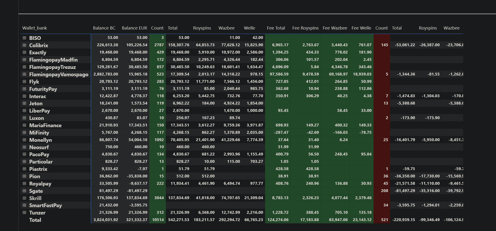
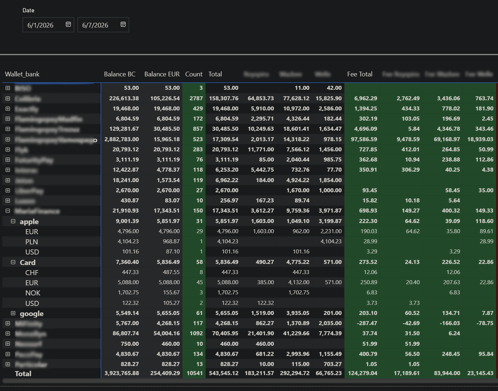
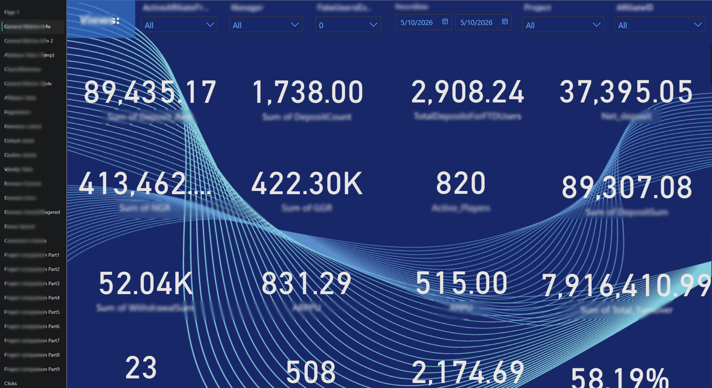

# Business Intelligence

This directory contains Power BI reports built on top of the centralized Microsoft Fabric analytical model, providing financial monitoring, reconciliation and executive reporting across multiple payment providers.

## Architecture

```text
Google Drive / APIs / Web Portal
            │
            ▼
        ETL Pipeline
            │
            ▼
        PostgreSQL
            │
            ▼
     Microsoft Fabric
            │
            ▼
vw_raw_data_normalized_v2
            │
            ▼
        main_data
            │
            ▼
     Power BI Reports
```

---

## Dashboards

### Wallet Performance Dashboard

Provides a consolidated financial overview of balances, deposits, withdrawals, commissions and payment provider performance.

<table>
<tr>

<td align="center">
<b>Wallet Performance</b><br><br>
<a href="screenshots/wallet_performance.png">

</a>
</td>

<td align="center">
<b>Wallet Performance Drill-down</b><br><br>
<a href="screenshots/wallet_performance_2.png">

</a>
</td>

</tr>
</table>

Supports hierarchical drill-down from provider level to wallet accounts and currencies while preserving consolidated financial metrics.

---

### Executive Dashboard

Provides high-level business KPIs for operational and financial monitoring.

<table>
<tr>

<td align="center">
<b>Executive Dashboard</b><br><br>
<a href="screenshots/Business_KPI_Dashboard.png">

</a>
</td>

</tr>
</table>

---

## Key Metrics

The dashboards provide a consolidated financial view including:

- Opening and closing balances
- Deposits and withdrawals
- Commissions
- Settlements
- Refunds and chargebacks
- Affiliate payments
- Operational expenses
- Multi-currency balances
- Historical EUR valuation

---

## Balance Calculation

```text
Opening Balance

+ Deposits
+ Top-Ups

- Withdrawals
- Fees
- Refunds
- Chargebacks
- Settlements
- Expenses

= Closing Balance
```

---

## Features

- Multi-provider financial reporting
- Balance reconciliation
- Commission analysis
- Project and company analysis
- Payment method analysis
- Multi-currency reporting
- Historical EUR conversion
- Interactive filtering
- Hierarchical drill-down
- Executive KPI dashboards

---

> **Note**
>
> The public repository contains representative dashboard screenshots only. Production Power BI reports, confidential financial data, semantic models and proprietary business logic have been intentionally omitted.